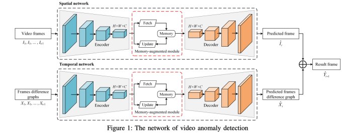
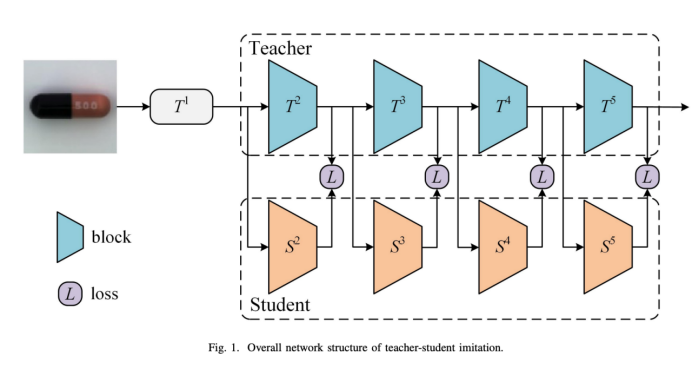
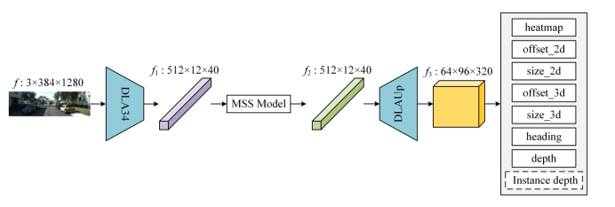
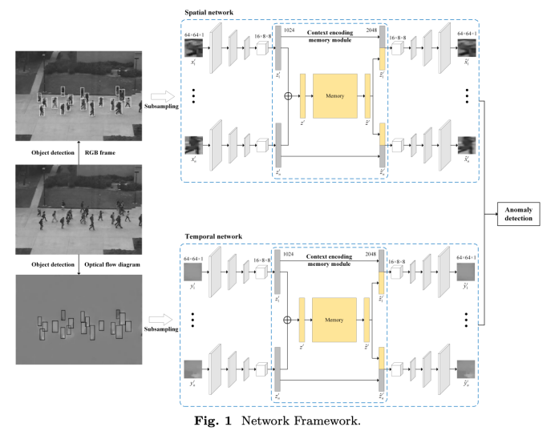
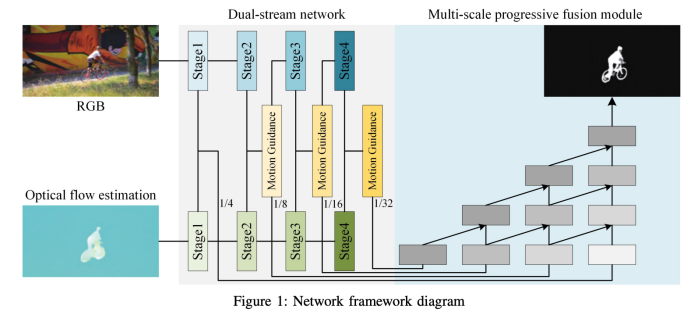
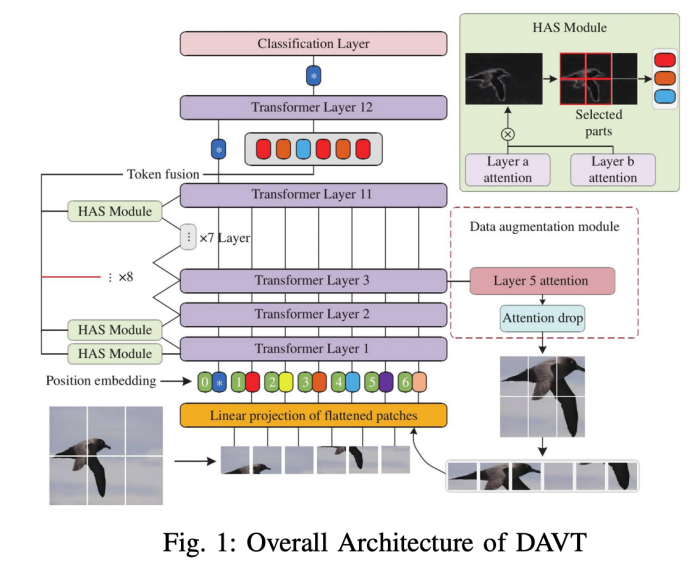
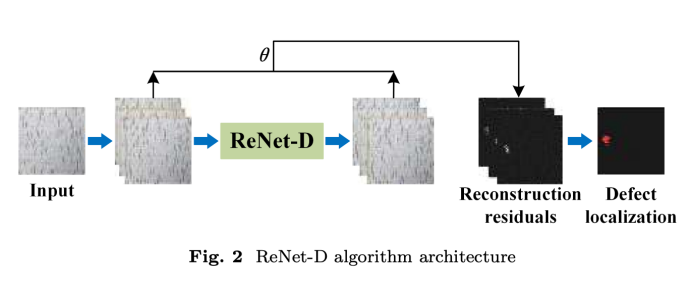

# About Me

* ***Ph.D from Shanghai Jiao Tong University, currently working at Unicom (Shanghai) Industry Internet Co., Ltd. as a senior expert.***
* ***IEEE Senior Member, Stanford Visiting Scholar, Shanghai Artificial Intelligence Association Talent Expert, Jiangsu Artificial Intelligence Association Talent Expert, China Unicom Science and Technology Committee Expert;***
* ***Published more than 30 academic papers in important journals, such as CVPR, ECCV, ICCV, IEEE TIP;***
* ***Participated in the research on visual display of three-dimensional SD-OCT retinal image lesions (high-level talent project of "Six Talent Peaks" in Jiangsu Province);***
* ***Rich research experience in the field of artificial intelligence machine vision and pattern recognition;***

## Research Directions

***Deep vision, image processing, analysis and recognition, mainly include the following aspects:image segmentation,
object tracking, image generation, image recovery(denoising, enhancement, deblurring), unsupervised anomaly detection.***

## Education

* ***Ph.D in Computer Science, Shanghai Jiao Tong University, 2015.***
* ***M.S. in Computer Science, Nanjing University of Science and Technology, 2010.***
* ***B.E. in Computer Science, Nanjing University of Technology, 2006.***

## Academic Experience

> ***Stanford University academic exchange for 3 months, 2018.***
>
> ***Hong Kong Polytechnic University academic exchange for 1 month, 2019.***

## Appointment

***Reviewer for several domestic and foreign academic journals and conferences, such as IEEE Transactions on Image Processing,
Pattern Recognition, IEEE Transactions on Signal Processing, International Journal of Image and Graphics, Computerized
Medical Imaging and Graphics, Computer Methods and Programs in Biomedicine, Journal of Visual Communication and Image
Representation, Signal Processing, Journal of Computer-Aided Design and Computer Graphics, Journal of Electronics and
Information Technology, Journal of Chinese Journal of Image and Graphics, etc.***

## Publications

* ***[Pedestrian Spatio-Temporal Information Fusion For Video Anomaly Detection](https://arxiv.org/pdf/2211.10052.pdf)***

* ***[Normal Learning in Videos with Attention Prototype Network](https://arxiv.org/pdf/2108.11055.pdf)***

* ***[Multi-scale Feature Imitation for Unsupervised Anomaly Localization](https://arxiv.org/pdf/2212.05786.pdf)***

* ***[IDMS: Instance Depth for Multi-scale Monocular 3D Object Detection](https://arxiv.org/pdf/2212.01528v1.pdf)***

* ***[Spatio-Temporal-based Context Fusion for Video Anomaly Detection](https://arxiv.org/pdf/2210.09572.pdf)***

* ***[Efficient Unsupervised Video Object Segmentation Network Based on Motion Guidance](https://arxiv.org/pdf/2211.05364.pdf)***

* ***[Data Augmentation Vision Transformer for Fine-grained Image Classification](https://arxiv.org/pdf/2211.12879.pdf)***

* ***[A Lightweight Reconstruction Network for Surface Defect Inspection](https://arxiv.org/pdf/2212.12878.pdf)***

* ***Application Strategy of Security Detection Technology in the Background of Computer Vision***
* ***A Fast Monocular 3D Object Detection Fusing Instance Depth***

| Publications                                                                                                      | pic                                                           |
|:------------------------------------------------------------------------------------------------------------------|:--------------------------------------------------------------|
| [Pedestrian Spatio-Temporal Information Fusion For Video Anomaly Detection](https://arxiv.org/pdf/2211.10052.pdf) |  |
| [Normal Learning in Videos with Attention Prototype Network](https://arxiv.org/pdf/2108.11055.pdf)                |  |
| [Multi-scale Feature Imitation for Unsupervised Anomaly Localization](https://arxiv.org/pdf/2212.05786.pdf)       |  |
| [IDMS: Instance Depth for Multi-scale Monocular 3D Object Detection](https://arxiv.org/pdf/2212.01528v1.pdf)      |  |
**For other academic achievements, please refer to relevant journals.**

